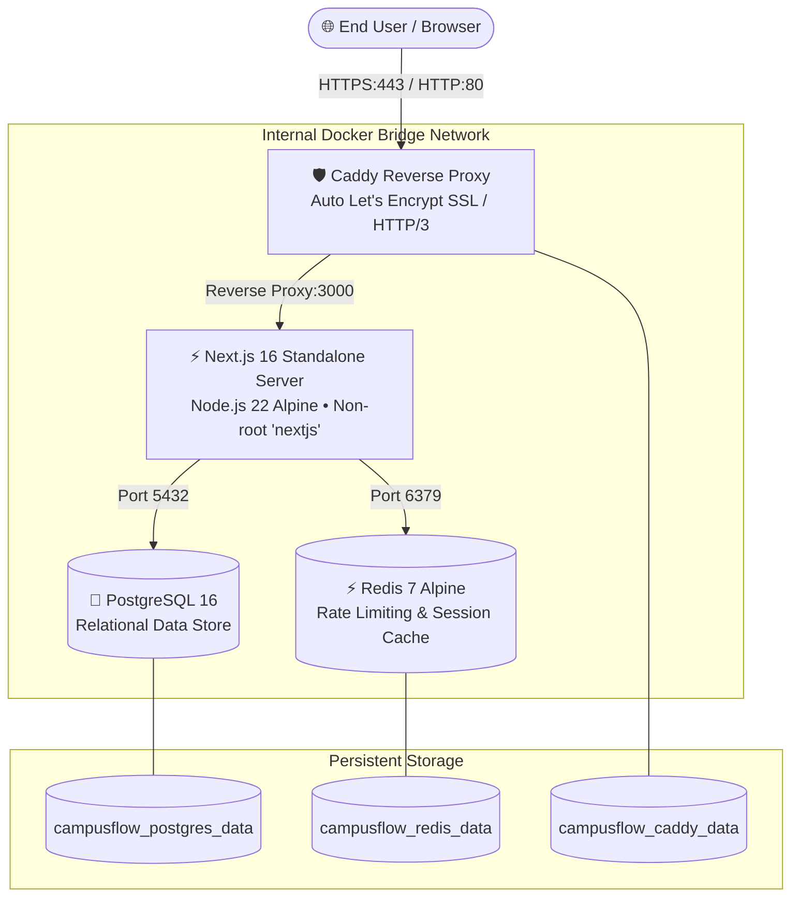
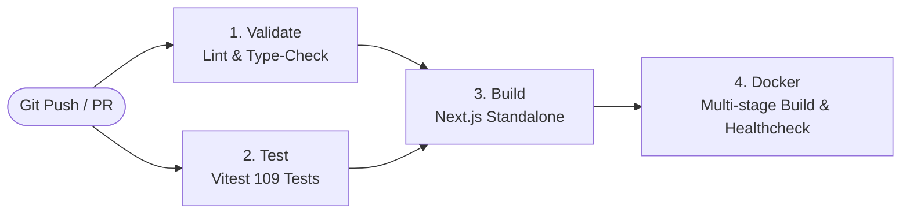

# 🚀 CampusFlow — DevOps, Containerization & Production Runbook

This document is the definitive operational guide for containerizing, testing, deploying, and maintaining **CampusFlow** in local development, continuous integration (CI/CD), and enterprise production environments.

---

## 1. System Architecture

CampusFlow uses an isolated containerized stack orchestrated via Docker Compose, fronted by a Caddy reverse proxy with automated TLS encryption.



---

## 2. Docker Containerization Strategy

### 2.1 Multi-Stage `Dockerfile`
CampusFlow employs a 4-stage multi-stage Docker build to achieve minimal attack surface, optimal layer caching, and a featherweight image footprint (~150MB):

1. **Stage 1: `base` (`node:22-alpine`)**
   - Installs minimal Alpine C runtime compatibility (`libc6-compat`).
2. **Stage 2: `deps`**
   - Copies `package.json`, `package-lock.json`, and `prisma/schema.prisma`.
   - Executes `npm ci --include=dev` to install exact dependencies.
   - Runs `npx prisma generate` to pre-compile the typed Prisma client.
3. **Stage 3: `builder`**
   - Copies application source code and cached node_modules.
   - Executes `npm run build` using Next.js standalone mode.
   - Generates minimal standalone Node.js server bundle at `.next/standalone`.
4. **Stage 4: `runner` (Production Runtime)**
   - Creates a dedicated non-root user (`nextjs:nodejs`, UID/GID 1001).
   - Copies only necessary output: `.next/standalone`, `.next/static`, and `public/`.
   - Embeds a native Alpine `HEALTHCHECK` pinging `http://localhost:3000/`.
   - Starts the server with `CMD ["node", "server.js"]` without needing npm or development toolchains.

### 2.2 `.dockerignore`
Prevents local artifacts, secrets, and test fixtures from polluting build context:
- `node_modules`, `.next`, `.git`
- `.env*` (all secrets and environment files)
- `tests`, `coverage`, `vitest.config.ts`
- `*.log`, `npm-debug.log*`

---

## 3. Environment Configurations

| File | Environment | Purpose |
|---|---|---|
| `.env.example` | Local / Staging | Template for local native development or local docker-compose testing. |
| `.env.production.example` | Production | Complete configuration template for cloud VPS and production containers. |
| `.env.production` | Production *(Secret)* | Actual production configuration with high-entropy cryptographic keys. **Never committed.** |

### Key Production Variables:
```env
NODE_ENV=production
DOMAIN_NAME=campusflow.edu
NEXT_PUBLIC_APP_URL=https://campusflow.edu
POSTGRES_USER=campusflow_admin
POSTGRES_PASSWORD=<strong-random-password-32-chars>
POSTGRES_DB=campusflow_production
DATABASE_URL=postgresql://${POSTGRES_USER}:${POSTGRES_PASSWORD}@db:5432/${POSTGRES_DB}?schema=public&connection_limit=20&pool_timeout=30
AUTH_SECRET=<openssl rand -base64 48>
SESSION_COOKIE_NAME=__Host-campusflow_session
REDIS_PASSWORD=<openssl rand -hex 24>
GEMINI_API_KEY=<production-google-gemini-key>
```

---

## 4. Docker Compose Stacks

### 4.1 Development Stack (`docker-compose.yml`)
Spins up the full stack locally with hot port exposures:
- **Web App**: Exposed on `http://localhost:3000`
- **Postgres**: Exposed on `localhost:5432`
- **Redis**: Exposed on `localhost:6379`

```bash
# Start local multi-container development environment
docker compose up -d

# View real-time logs
docker compose logs -f web

# Stop containers
docker compose down
```

### 4.2 Production Stack (`docker-compose.prod.yml`)
Hardened configuration for live deployments:
- **Port Exposure**: Only ports `80` and `443` (HTTP/3 UDP included) are exposed publicly through Caddy. Web, Postgres, and Redis remain entirely isolated within the private bridge network (`campusflow-internal-net`).
- **Resource Limits**:
  - `web`: Max 2.0 CPU cores, 2048MB RAM (Reserved: 0.5 CPU, 512MB RAM).
  - `db`: Max 2.0 CPU cores, 2048MB RAM (Reserved: 0.5 CPU, 512MB RAM).
  - `redis`: Max 0.5 CPU cores, 512MB RAM.
- **Log Rotation**: Automated JSON log rotation (max 10MB per file, max 5 files retained per container) to protect disk space.
- **Automatic Restart**: `restart: always` across all services.

---

## 5. Reverse Proxy & Automated SSL (Caddy)

CampusFlow utilizes [Caddy v2](https://caddyserver.com/) for automated certificate management:
- **Zero-Touch HTTPS**: Automatically negotiates and renews Let's Encrypt / ZeroSSL certificates without needing external certbot cron jobs.
- **HTTP/3 Support**: Supports UDP-based QUIC for low-latency connections on mobile campus networks.
- **High-Performance Compression**: Automatically compresses text responses using `zstd` and `gzip`.
- **Security Headers Injected**:
  - `Strict-Transport-Security: max-age=63072000; includeSubDomains; preload`
  - `X-Content-Type-Options: nosniff`
  - `X-Frame-Options: DENY`
  - `Referrer-Policy: strict-origin-when-cross-origin`

---

## 6. Continuous Integration & Delivery (CI/CD)

The automated GitHub Actions workflow (`.github/workflows/ci.yml`) runs on every `push` and `pull_request` across `main`, `master`, and `feat/*` branches.



### Pipeline Jobs:
1. **`validate` (Code Quality & Types)**:
   - Installs frozen dependencies with `npm ci`.
   - Generates Prisma client types.
   - Executes strict `npx tsc --noEmit`.
2. **`test` (Automated Test Execution)**:
   - Runs full Vitest suite (109 Unit, Integration, and API Route tests).
3. **`build` (Production Bundle Verification)**:
   - Verifies that Next.js standalone build compiles cleanly without bundle warnings.
4. **`docker` (Container Build & Health Validation)**:
   - Builds image with Docker Buildx and GitHub Actions layer caching (`type=gha`).
   - Boots container instance and verifies HTTP 200 response on `http://localhost:3000/`.

---

## 7. Production Deployment & Zero-Downtime Rollout

### 7.1 Automated Deployment (`scripts/deploy.sh`)
For Linux/Ubuntu VPS hosts:

```bash
# Make script executable
chmod +x scripts/deploy.sh scripts/backup-db.sh

# Run full deployment pipeline
./scripts/deploy.sh
```

**What the script does automatically:**
1. Validates presence of Docker, Compose v2, and `.env.production`.
2. Creates an automated compressed PostgreSQL database backup via `scripts/backup-db.sh`.
3. Builds latest production Docker image with cache re-use.
4. Ensures PostgreSQL and Redis are active and healthy.
5. Executes `npx prisma migrate deploy` safely before routing traffic.
6. Starts updated web container and Caddy proxy without dropping connections.
7. Polls container healthcheck until HTTP status is confirmed healthy.
8. Prunes obsolete dangling images to maintain disk hygiene.

### 7.2 Windows Deployment (`scripts/deploy.ps1`)
For Windows Server environments:
```powershell
.\scripts\deploy.ps1 -Env "prod"
```

---

## 8. Database Migration & Backup Runbook

### 8.1 Schema Migrations Policy
- **Local Development**:
  ```bash
  npx prisma migrate dev --name <migration_name>
  ```
- **Production Server**:
  **Never** run `prisma migrate dev` or `prisma db push` in production. Always apply verified migrations using:
  ```bash
  docker compose -f docker-compose.prod.yml run --rm web npx prisma migrate deploy
  ```

### 8.2 Database Backups (`scripts/backup-db.sh`)
Automated backup script uses `pg_dump` with gzip compression and a 14-day rolling retention policy.

```bash
# Manual backup execution
./scripts/backup-db.sh
```

**Automate Daily Backups via Crontab:**
```bash
# Run backup daily at 2:00 AM
0 2 * * * cd /opt/campusflow && ./scripts/backup-db.sh >> /var/log/campusflow_backup.log 2>&1
```

### 8.3 Disaster Recovery / Database Restoration
To restore a database from a `.sql.gz` snapshot:
```bash
# 1. Unzip the backup file
gunzip -k backups/campusflow_db_20260925_090000.sql.gz

# 2. Pipe into the production postgres container
cat backups/campusflow_db_20260925_090000.sql | docker compose -f docker-compose.prod.yml exec -T db psql -U campusflow_admin -d campusflow_production
```

---

## 9. Rollback Strategy

If a newly deployed image exhibits unforeseen runtime anomalies:

1. **Rollback Container Image**:
   ```bash
   # Revert to previous git release tag
   git checkout tags/v1.18.0

   # Redeploy previous stable build
   ./scripts/deploy.sh
   ```

2. **Rollback Database Migration (If Required)**:
   ```bash
   # Restore pre-deployment database backup created by deploy.sh
   gunzip -k backups/campusflow_db_<pre_deploy_timestamp>.sql.gz
   cat backups/campusflow_db_<pre_deploy_timestamp>.sql | docker compose -f docker-compose.prod.yml exec -T db psql -U campusflow_admin -d campusflow_production
   ```

---

## 10. Operations & Monitoring Cheat Sheet

```bash
# Check status of all production containers
docker compose -f docker-compose.prod.yml ps

# View live consolidated logs
docker compose -f docker-compose.prod.yml logs -f --tail=100

# Inspect real-time CPU & memory consumption
docker stats campusflow-web-prod campusflow-db-prod campusflow-redis-prod campusflow-caddy-prod

# Execute an interactive psql session in Postgres
docker compose -f docker-compose.prod.yml exec db psql -U campusflow_admin -d campusflow_production

# Inspect Redis cache keys
docker compose -f docker-compose.prod.yml exec redis redis-cli -a <REDIS_PASSWORD> ping

# Restart Caddy after domain or SSL configuration change
docker compose -f docker-compose.prod.yml restart caddy
```
