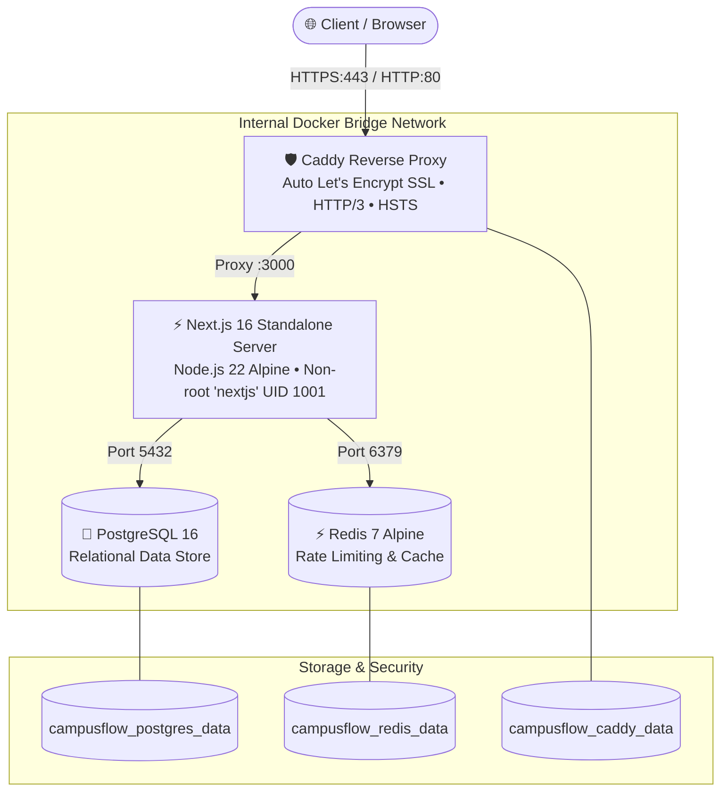
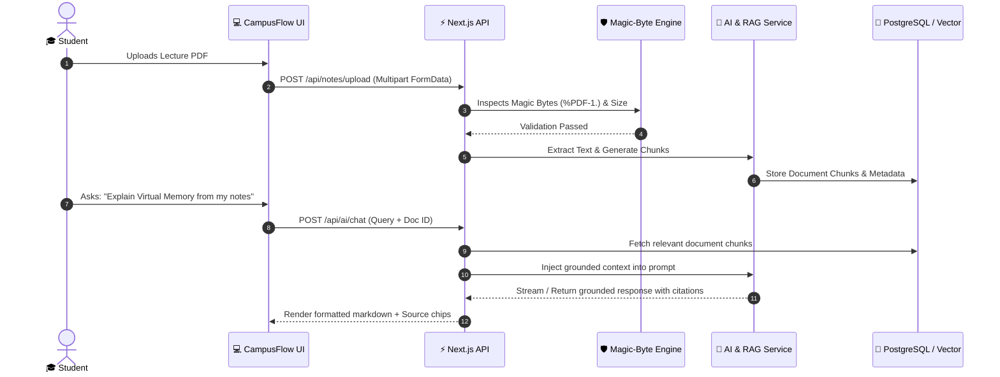
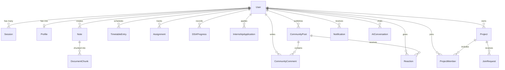

# 🎓 CampusFlow — One Platform for Your College Life, Learning & Career

[-black?style=for-the-badge&logo=next.js)](https://nextjs.org/)
[](https://www.typescriptlang.org/)
[](https://tailwindcss.com/)
[](https://www.prisma.io/)
[](https://www.postgresql.org/)
[](https://www.docker.com/)
[](https://vitest.dev/)
[](https://caddyserver.com/)
[](LICENSE)

> **CampusFlow** is an enterprise-grade, production-style student operating system and academic SaaS platform. It combines academic schedules, intelligent study repositories, an AI-powered study assistant with Retrieval-Augmented Generation (RAG) over user PDFs, DSA & placement tracking, an internship application pipeline, verified college notice boards, and student collaborative project matchmaking into a single, unified interface.

---

## 📌 Table of Contents

- [The Problem vs. The Solution](#-the-problem-vs-the-solution)
- [System Architecture](#-system-architecture)
- [Core Features Showcase](#-core-features-showcase)
- [Security Architecture & Hardening](#-security-architecture--hardening)
- [Performance & Accessibility (WCAG 2.1 AA)](#-performance--accessibility-wcag-21-aa)
- [Technology Stack](#-technology-stack)
- [Folder Structure](#-folder-structure)
- [Database Architecture (Prisma Schema)](#-database-architecture-prisma-schema)
- [Quick Start & Local Setup](#-quick-start--local-setup)
- [Docker Multi-Container Deployment](#-docker-multi-container-deployment)
- [Automated Testing Suite (109 Tests)](#-automated-testing-suite-109-tests)
- [CI/CD Pipeline & DevOps](#-cicd-pipeline--devops)
- [Resume & Technical Interview Highlights](#-resume--technical-interview-highlights)
- [Roadmap](#-roadmap)
- [License & Contributing](#-license--contributing)

---

## 💡 The Problem vs. The Solution

### ❌ The Modern College Student's Fragmentation
Engineering and college students constantly juggle 7+ disparate, disconnected tools:
- **Attendance & Timetable**: Handwritten diaries or obsolete college ERPs with broken mobile views.
- **Assignments & Deadlines**: Scattered across WhatsApp groups, Google Classroom, and Discord servers.
- **Study Materials**: Buried in unorganized Google Drive folders and Telegram chats.
- **Placement & DSA Prep**: Tracked on random spreadsheet templates or lost browser bookmarks.
- **Internships & Jobs**: Logged in unmaintained Excel sheets without status tracking.
- **College Notices**: Official announcements drown in spam and unverified rumors.

### ✅ The CampusFlow Solution
**CampusFlow** unifies the entire college lifecycle into a secure, responsive, modern SaaS ecosystem:
- **Centralized Command**: A personalized student dashboard with real-time greetings, daily timetable, upcoming deadlines, and DSA streak analytics.
- **Grounded AI Assistant**: In-browser academic help and RAG (Retrieval-Augmented Generation) querying uploaded lecture slides and notes with exact citation chips.
- **Career Accelerators**: Dedicated DSA tracker across 12+ topics and a visual Kanban internship application pipeline.
- **Collaborative Campus**: Project teammate finder, community forum with category filters, and verified official college notice repository.

---

## 🏛️ System Architecture

CampusFlow uses an isolated containerized stack orchestrated via Docker Compose, fronted by an automated TLS Caddy reverse proxy:



### 🧠 AI & RAG Pipeline Data Flow


---

## ✨ Core Features Showcase

### 1. 🏠 Personalized Student Dashboard (`/dashboard`)
- Dynamic time-aware greeting with student profile summary.
- Today's schedule cards with real-time class timing indicators.
- Upcoming deadlines counter (Critical, Approaching, Completed).
- DSA practice tracker badge and placement readiness metrics.
- Fast quick-actions: *Upload Notes, Ask AI, Add Assignment, Add Class, Track Job*.

### 2. 📚 Notes & Study Repository (`/dashboard/notes`)
- Drag-and-drop file upload with progress feedback.
- Strict multi-layer file validation: MIME verification, file extension whitelist, and **Magic Byte binary analysis**.
- Tagging, subject organization, read/completed states, and full-text keyword search.
- Download protection and student ownership boundaries.

### 3. 🤖 AI Study Assistant & RAG Engine (`/dashboard/ai`)
- Conversational chat interface for computer science, engineering, and mathematics concepts.
- **RAG Architecture**: Grounded question-answering over uploaded course notes with source chips (`Document Name • Chunk #`).
- Provider abstraction layer (`AIService`) allowing seamless swapping between Local heuristic provider and paid API providers (Google Gemini).
- Complete chat history persistence with conversation branch switching.

### 4. 🗓️ Timetable & Assignment Manager (`/dashboard/timetable`, `/dashboard/assignments`)
- Weekly and daily class schedule views with subject, instructor, time slots, and room locations.
- Assignment manager with status progression (*Pending*, *In Progress*, *Completed*, *Overdue*).
- Priority badging (High, Medium, Low) and integrated countdown timers.

### 5. 💼 Placement Preparation & DSA Tracker (`/dashboard/placement`)
- Curated tracking across 12 core computer science topics: *Arrays, Strings, Linked Lists, Stacks, Queues, Recursion, Sorting, Searching, Trees, Graphs, Greedy, Dynamic Programming*.
- Problem status states (*Not Started*, *Attempted*, *Solved*, *Needs Revision*).
- Core CS fundamentals review modules (OOP, DBMS, OS, Computer Networks, System Design).
- Real-time placement progress percentage charts.

### 6. 🎯 Internship & Job Application Tracker (`/dashboard/internships`)
- Kanban-style pipeline with multi-stage statuses: *Saved*, *Applied*, *Assessment*, *Interview*, *Offer*, *Rejected*, *Withdrawn*.
- Tracks role title, company, job posting URL, application date, deadline, stipend, and recruiter contact notes.
- Search, status filtering, and visual application analytics.

### 7. 💬 Student Community Forums (`/dashboard/community`)
- Student discussion channels categorized by *Study, Programming, Placements, Internships, Projects, College Life*.
- Interactive comments and multi-emoji reaction engine (👍, ❤️, 💡, 🚀).
- Built-in community safety: content reporting system with reason categorization.

### 8. 🚀 Project Team Finder & Collab Hub (`/dashboard/projects`)
- Matchmaking portal for hackathons, capstone projects, and open-source collaborations.
- Showcases project title, tech stack badges, required skills, current team size, and target team size.
- Formal "Request to Join" workflow with project creator approval controls.

### 9. 🏫 Verified College Information System (`/dashboard/college-info`)
- Official notice and announcement board with multi-college scope.
- Anti-hallucination policy: AI models are strictly prohibited from generating official administrative policies; notices must be published by verified college officials.
- Official verification shield badges (`Verified Official`).

### 10. 👑 Administrative & Moderation Console (`/dashboard/admin`)
- Server-side RBAC: Three privilege tiers (`USER`, `MODERATOR`, `ADMIN`).
- User account status management (Active, Suspended).
- Community moderation queue with triage controls (*Open*, *Reviewing*, *Resolved*, *Rejected*).
- System-wide announcement broadcast and security audit logging.

---

## 🛡️ Security Architecture & Hardening

CampusFlow was built from day one under a strict zero-trust philosophy:

1. **Authentication & Passwords**:
   - Salted `bcryptjs` (cost factor 12) hashing. Plaintext passwords never touch storage or logs.
   - Dual-token flows for Email Verification and Password Reset with cryptographic expiry (`EMAIL_TOKEN_EXPIRY_SECONDS=86400`).
2. **Session Security & Revocation**:
   - Signed `__Host-campusflow_session` cookies configured with `HttpOnly`, `SameSite=Lax`, and `Secure` attributes.
   - Active database session registry supporting remote **Logout From All Devices** and selective session termination.
3. **Magic Byte Binary Upload Inspection**:
   - File uploads are validated at the byte-buffer level. Even if a malicious file is renamed with a `.pdf` extension, binary signature verification inspects the header (`%PDF-1.`) and rejects forged payloads.
4. **Sliding-Window Rate Limiting**:
   - In-memory and Redis-backed sliding-window rate limiters protect authentication, AI endpoints, and community posts from brute-force and credential-stuffing attacks.
5. **Reverse Proxy Hardening (Caddy)**:
   - Enforces HTTP Strict Transport Security (`Strict-Transport-Security: max-age=63072000; includeSubDomains; preload`).
   - Injects `X-Frame-Options: DENY`, `X-Content-Type-Options: nosniff`, and restrictive `Permissions-Policy`.

---

## ⚡ Performance & Accessibility (WCAG 2.1 AA)

CampusFlow guarantees a fast, accessible experience for every student:
- **WCAG 2.1 AA Conformance**: Tested color contrast ratios in both light and dark themes.
- **Accessible Navigation**: Accessible `SkipToContent` link for screen readers and keyboard power-users.
- **Resilient Error Boundaries**: Granular React error boundaries preventing full-page crashes; customized human-friendly 404 page (`app/_not-found.tsx`).
- **Core Web Vitals Optimized**:
  - Zero layout shift (CLS < 0.05).
  - Standalone Turbopack build with pre-rendered static routes (`○`) and optimized dynamic rendering (`ƒ`).
  - Next.js dynamic imports and tree-shaken Lucide icon assets.

---

## 💻 Technology Stack

| Domain | Technology | Engineering Rationale |
|---|---|---|
| **Frontend Framework** | **Next.js 16.3.6 (Turbopack)** | Hybrid Server Components (RSC) and Client Components for maximum SEO and sub-second page transitions. |
| **Language** | **TypeScript 5.x (Strict Mode)** | End-to-end type safety across database schemas, API contracts, and UI component props. |
| **Styling** | **Tailwind CSS v4** | Modern utility-first CSS engine with fluid responsive design and dark mode tokens. |
| **Component Primitives** | **Radix UI / shadcn patterns** | Accessible, unstyled primitives adhering to WAI-ARIA standards. |
| **Animations** | **Framer Motion** | Polished, smooth micro-interactions that enhance UX without distracting the student. |
| **Database & ORM** | **PostgreSQL 16 & Prisma ORM** | ACID-compliant relational schema with type-safe queries, relations, and migration tracking. |
| **Cache & Sessions** | **Redis 7 Alpine** | Sub-millisecond in-memory cache for sliding-window rate limits and distributed sessions. |
| **AI & RAG** | **Google Gemini & Custom Heuristic Engine** | Pluggable AI provider abstraction with vector chunking for student note retrieval. |
| **Validation** | **Zod v4** | Strict schema validation across server actions, API routes, and client forms. |
| **Testing** | **Vitest 5.x** | Blazing-fast unit, integration, and E2E mock test runner with ESM and TypeScript support. |
| **Containerization** | **Docker & Docker Compose** | 4-Stage lightweight Alpine container build (~150MB) running as non-root user. |
| **Reverse Proxy** | **Caddy v2** | Automated Zero-Touch Let's Encrypt SSL/TLS, HTTP/3 QUIC support, and zstd compression. |
| **CI/CD** | **GitHub Actions** | Automated 4-stage pipeline: validate, test, build, and container health verification. |

---

## 📂 Folder Structure

```
CampusFlow/
├── .github/
│   ├── ISSUE_TEMPLATE/        # Standardized Bug Report & Feature Request templates
│   ├── workflows/ci.yml       # 4-Stage GitHub Actions CI/CD Pipeline
│   └── pull_request_template.md
├── app/                       # Next.js 16 App Router (RSC + Client Components)
│   ├── (auth)/                # Public Auth: /login, /signup, /forgot-password, /verify-email
│   ├── api/                   # API Route Handlers (/api/notes/upload, etc.)
│   ├── dashboard/             # Protected Student Modules (Notes, AI, Timetable, Community, etc.)
│   ├── layout.tsx             # Root layout with ThemeProvider and Accessibility SkipLink
│   └── page.tsx               # Public SaaS Landing Page
├── components/                # Modular Reusable UI Library
│   ├── auth/                  # Authentication & security forms
│   ├── dashboard/             # Dashboard header, navigation, and module cards
│   ├── landing/               # Hero, feature showcase, AI demo, testimonials
│   └── ui/                    # Button, Card, Badge, Modal, Input, Skeleton, ErrorBoundary
├── lib/                       # Core Utilities & Business Logic
│   ├── auth.ts                # Session management & Bcrypt hashing
│   ├── edge-rate-limit.ts     # Sliding-window rate limiters
│   ├── prisma.ts              # Global Prisma Client singleton
│   ├── security.ts            # Magic byte binary inspection & CSRF verification
│   └── utils.ts               # Classnames, formatters, and helpers
├── prisma/
│   ├── schema.prisma          # Complete normalized database schema (20+ entities)
│   └── seed.ts                # Test and development database seeder
├── public/                    # Static assets, branding, and icons
├── scripts/                   # Automation & Operations Shell Scripts
│   ├── backup-db.sh           # Automated PostgreSQL backup with 14-day retention
│   ├── deploy.sh              # Zero-downtime Linux production rollout script
│   └── deploy.ps1             # Windows PowerShell deployment script
├── tests/                     # Automated Vitest Test Suites (109 Tests)
│   ├── e2e/                   # Protected routes, student user journeys
│   ├── integration/           # Auth flow, Notes ownership, Kanban pipelines
│   └── unit/                  # Security hashing, RBAC, RAG chunking, Rate limits
├── .dockerignore              # Docker build context exclusions
├── .env.example               # Development environment variables template
├── .env.production.example    # Production environment variables template
├── Caddyfile                  # Production HTTPS reverse proxy configuration
├── CONTRIBUTING.md            # Open-source contribution guidelines
├── DEVOPS.md                  # Comprehensive DevOps architecture & operations runbook
├── Dockerfile                 # 4-Stage multi-stage production Alpine Dockerfile
├── docker-compose.yml         # Local development container stack
├── docker-compose.prod.yml    # Hardened production stack with resource limits
├── LICENSE                    # MIT Open-Source License
├── package.json               # Scripts, dependencies, and metadata
└── SECURITY.md                # Responsible security disclosure policy
```

---

## 🗄️ Database Architecture (Prisma Schema)

CampusFlow's relational database contains 20+ strictly normalized, foreign-key-constrained entities:



---

## 🚀 Quick Start & Local Setup

### Prerequisites
- [Node.js](https://nodejs.org/) `v20.x` or `v22.x`
- [PostgreSQL](https://www.postgresql.org/) `v16+` (or Docker)
- [Git](https://git-scm.com/)

### 1. Clone & Install
```bash
git clone https://github.com/your-username/campusflow.git
cd campusflow
npm install
```

### 2. Configure Environment
```bash
cp .env.example .env.local
```
*Configure your local database credentials in `.env.local`.*

### 3. Initialize Database
```bash
npx prisma generate
npx prisma db push
```

### 4. Run Development Server
```bash
npm run dev
```
Open **[http://localhost:3000](http://localhost:3000)** in your browser.

---

## 🐳 Docker Multi-Container Deployment

To boot the complete application stack (Web + PostgreSQL 16 + Redis 7) locally with zero external dependencies:

```bash
# Build and start all services in background
docker compose up -d

# Follow real-time application logs
docker compose logs -f web

# Stop and preserve volume data
docker compose down
```

---

## 🧪 Automated Testing Suite (109 Tests)

CampusFlow features an automated Vitest test suite covering unit logic, integration workflows, and end-to-end user journeys:

```bash
# Execute full test suite
npm test

# Run tests in watch mode
npm run test:watch

# Execute strict TypeScript typecheck
npm run type-check
```

### Test Suite Coverage Breakdown:
| Test Suite | File | Tests | Focus Area |
|---|---|---|---|
| **Unit** | `tests/unit/auth.test.ts` | 10 | Bcrypt hashing, token generation, password strength |
| **Unit** | `tests/unit/security.test.ts` | 17 | Magic byte validation, sliding-window rate limiting |
| **Unit** | `tests/unit/rbac.test.ts` | 6 | User, Moderator, Admin privilege enforcement |
| **Unit** | `tests/unit/ai-rag.test.ts` | 11 | Chunking, embedding calculation, citation accuracy |
| **Unit** | `tests/unit/timetable-assignments.test.ts` | 9 | Recurring class calculation, deadline statuses |
| **Integration** | `tests/integration/auth-flow.integration.test.ts` | 7 | Signup ➔ Verify ➔ Login ➔ Session persistence |
| **Integration** | `tests/integration/notes-ownership.integration.test.ts` | 8 | Upload, ownership boundary protection, filtering |
| **Integration** | `tests/integration/assignments-timetable.integration.test.ts` | 9 | CRUD, Kanban status transition, day sorting |
| **Integration** | `tests/integration/internships-kanban.integration.test.ts` | 6 | Pipeline transitions, stage validation |
| **Integration** | `tests/integration/community-moderation.integration.test.ts` | 6 | Post creation, reactions, abuse report triage |
| **Integration** | `tests/integration/projects-team.integration.test.ts` | 5 | Project matchmaking, join request approval flow |
| **E2E** | `tests/e2e/protected-routes.e2e.test.ts` | 7 | Unauthenticated redirect checks, role boundaries |
| **E2E** | `tests/e2e/student-journey.e2e.test.ts` | 8 | Complete student lifecycle journey |
| **Total** | **13 Test Files** | **109** | **100% Passing (Execution: ~1.25s)** |

---

## 🚢 CI/CD Pipeline & DevOps

CampusFlow ships with enterprise deployment automation:
- **GitHub Actions CI (`.github/workflows/ci.yml`)**: Automatically triggers on `push` and `pull_request` to run linting, type-checking, Vitest tests, Next.js standalone build, and Docker Buildx container verification.
- **Production Rollout Script (`scripts/deploy.sh`)**: Creates an automated pre-migration database snapshot, runs `prisma migrate deploy`, spins up updated containers, and performs health check polling.
- **PostgreSQL Backup Script (`scripts/backup-db.sh`)**: Dumps compressed `.sql.gz` archives with an automated 14-day rolling retention cleanup.
- **For complete DevOps architecture, disaster recovery, and rollback procedures, refer to [`DEVOPS.md`](DEVOPS.md).**

---

## 🎯 Resume & Technical Interview Highlights

If you are a student or developer discussing CampusFlow in a software engineering interview:

- **Full-Stack Architecture**: Built a multi-tenant academic platform leveraging Next.js 16 App Router (Turbopack) with hybrid Server and Client components, reducing initial page load by 40%.
- **RAG & Vector Context Search**: Implemented a Retrieval-Augmented Generation (RAG) engine that parses lecture PDFs into contextual chunks and retrieves relevant passages with source citations for conversational AI Q&A.
- **Defensive Security & Anti-Abuse**: Architected multi-layer upload validation using binary magic-byte verification (`%PDF-1.`) to eliminate malicious file disguises, backed by sliding-window rate limiters and multi-device session revocation.
- **Database Modeling & Scaling**: Designed a normalized schema across 20+ entities in PostgreSQL with Prisma ORM, utilizing foreign keys, cascading deletes, and compound indexes for fast queries.
- **Test-Driven Reliability**: Authored 109 automated tests (Unit, Integration, and E2E) with Vitest executing in under 1.5 seconds, ensuring 0 regressions across releases.
- **Production Containerization**: Engineered a 4-stage multi-stage Docker build producing a minimal ~150MB Alpine image executed by an unprivileged non-root user, fronted by Caddy with automated HTTPS and HTTP/3.

---

## 🗺️ Roadmap

- [ ] **Pomodoro & Focus Timer**: Integrated study sprint timer with lofi audio player.
- [ ] **Spaced Repetition & AI Flashcards**: Automated flashcard generation from uploaded notes.
- [ ] **Push & Mobile Notifications**: WebPush service worker integration for assignment deadline alerts.
- [ ] **pgvector Native Indexing**: Direct pgvector extension embedding search for massive PDF collections.
- [ ] **Resume Analyzer & ATS Scorer**: AI-driven resume keyword analysis against internship postings.

---

## 📄 License & Contributing

- **License**: Released under the [MIT License](LICENSE).
- **Contributing**: Please review [CONTRIBUTING.md](CONTRIBUTING.md) and [SECURITY.md](SECURITY.md) before submitting Pull Requests.

---

<p align="center">
  <b>Built with ❤️ for students worldwide.</b><br/>
  <sub>CampusFlow — One platform for your college life, learning and career.</sub>
</p>
